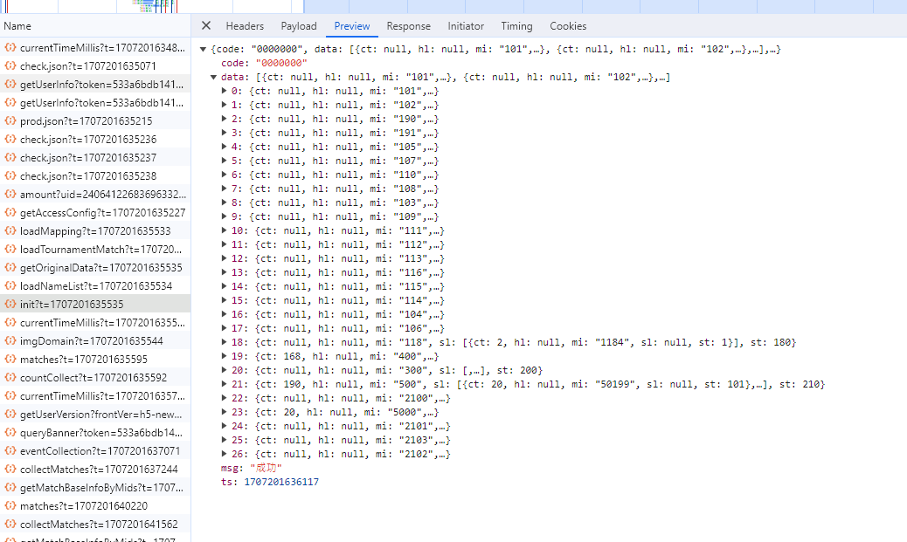

#  客户端模块化-新人路线-菜单

##  球种分类
```javascript
//常规球类 id csid
1: "足球"  
2: "篮球"
3: "棒球"
4: "冰球"
5: "网球"
6: "美式足球"
7: "斯诺克"
8: "乒乓球"
9: "排球"
10: "羽毛球"
11: "手球"
12: "拳击/格斗"
13: "沙滩排球"
14: "橄榄球"
15: "曲棍球"
16: "水球"
17: "田径"
18: "娱乐"
19: "游泳"
20:"体操"
21:"跳水"
22:"射击"
23:'举重'
24:'射箭'
25:'击剑'
26: "冰壶",
27: "跆拳道"
28: "高尔夫"
29: "自行车"
30: "赛马"
31: "帆船"
32: "划船"
33: "赛车"
34: "柔道"
35: "空手道"
36: "摔跤"
37: "板球"
38: "飞镖"
39: "沙滩足球"
40: "其他"
50:"趣味 "
//电子球类 csid
90: "电子足球"
91: "电子篮球"
//Vr球种 csid   ( 全id => `3${csid}` )
1001:"VR足球"
1002:"VR赛狗"
1004:"VR篮球"
1009:"VR泥地摩托车" 
1010:"VR摩托车"
1011:"VR赛马"
//电子竞技 csid  ( 全id => `2${csid}` )
100:"英雄联盟"
101:"Dota2"
102:"CS:GO/CS2"
103:"王者荣耀"


//一级菜单
1:"滚球" 
2:"今日"
3:"早盘"
4:"冠军" 
5:"即将开赛"
6："串关"
300:"VR体育"
400:"冠军"
2000:"电竞" 
5000："热门赛种" //复刻版50000 5000
0:"收藏" //自定义id 0 
28:"赛果" 
```


## 球种关联
#### 映射  (yewu11/v3/menu/loadMapping => Object.h（移动端id）Object.p（pc端id）)
* 今日2 滚球1 早盘3 串关6 即将开赛5
    ######  生成唯一id 
    ```javascript

    const mi = `${常规球类csid}${一级菜单id}`;
    //例如 足球今日  1012

    ```
    
------------
* 冠军 热门赛种
    ######  取id对应sl
     ```javascript

    //冠军 400 下sl
    const miArr = item.sl.map(n=>{
        return n.mi;//401 402.....
    })
    //冠军 5000 下sl
    const miArr = item.sl.map(n=>{
        return n.mi;//401 402.....
    })

    ```
------------
* 电竞、 vr体育
    ######  取id对应sl
     ```javascript

    //电竞 2000+ （2100 2101 2103 2102）
    const miArr = data.filter(n=>{
        return +n.mi > 2000 && +n.mi < 3000;
    })
    //vr体育 300 下sl
    const miArr = item.sl.map(n=>{
        return n.mi;//31001 31002.....
    })

    ```

* 赛果、收藏
    ######  取常规球种csid 一级id28
     ```javascript
    const csid = 1;
    //根据 csid 取赛果收藏

    ```

## 方法调用  h5通用

#### MatchMeta
```javascript

// 清除赛事折叠信息  前置
 MatchDataBaseH5.init()
 MatchFold.clear_fold_info()

// 冠军拉取旧接口； 待 元数据提供 冠军赛事后 再删除
MatchMeta.get_champion_match()
// 赛果
MatchMeta.get_results_match()
// 电竞
 MatchMeta.get_esports_match()
//收藏 
MatchMeta.get_collect_match()
//热门赛种 csid 原始id 101=>1
MatchMeta.get_top_events_match(item.csid)
// 今日  滚球 早盘 串关  走元数据
MatchMeta.set_origin_match_data()
MatchMeta.filter_match_by_time(item.val)//时间筛选
```
#### MenuData

```javascript
//一级菜单
this.current_lv_1_menu_i = 2; //今日
//二级菜单 ${球种id}${一级菜单}
this.current_lv_2_menu_i = 1012; //今日足球

```

## init接口JSON对比



```javascript
    {
	"code":"0000000",
	"data":[
		{
			"ct":null,
			"hl":null,
			"mi":"101",
			"sl":[
				{
					"ct":26,
					"hl":null,
					"mi":"1011",
					"sl":null,
					"st":1
				},
				{
					"ct":2,
					"hl":null,
					"mi":"1015",
					"sl":null,
					"st":2
				},
				{
					"ct":236,
					"hl":1,
					"mi":"1012",
					"sl":[
						{
							"ct":236,
							"hl":null,
							"mi":"101201",
							"sl":null,
							"st":10
						},
						{
							"ct":208,
							"hl":null,
							"mi":"101202",
							"sl":null,
							"st":20
						},
						{
							"ct":122,
							"hl":null,
							"mi":"101203",
							"sl":null,
							"st":30
						},
						{
							"ct":232,
							"hl":null,
							"mi":"101204",
							"sl":null,
							"st":40
						},
						{
							"ct":212,
							"hl":null,
							"mi":"101205",
							"sl":null,
							"st":50
						},
						{
							"ct":212,
							"hl":null,
							"mi":"101206",
							"sl":null,
							"st":60
						},
						{
							"ct":231,
							"hl":null,
							"mi":"101207",
							"sl":null,
							"st":70
						},
						{
							"ct":212,
							"hl":null,
							"mi":"101208",
							"sl":null,
							"st":80
						},
						{
							"ct":212,
							"hl":null,
							"mi":"101209",
							"sl":null,
							"st":90
						},
						{
							"ct":94,
							"hl":null,
							"mi":"101210",
							"sl":null,
							"st":100
						},
						{
							"ct":6,
							"hl":null,
							"mi":"101211",
							"sl":null,
							"st":110
						}
					],
					"st":3
				},
				{
					"ct":960,
					"hl":null,
					"mi":"1013",
					"sl":[
						{
							"ct":960,
							"hl":null,
							"mi":"101301",
							"sl":null,
							"st":10
						},
						{
							"ct":954,
							"hl":null,
							"mi":"101302",
							"sl":null,
							"st":20
						},
						{
							"ct":879,
							"hl":null,
							"mi":"101303",
							"sl":null,
							"st":30
						},
						{
							"ct":960,
							"hl":null,
							"mi":"101304",
							"sl":null,
							"st":40
						},
						{
							"ct":960,
							"hl":null,
							"mi":"101305",
							"sl":null,
							"st":50
						},
						{
							"ct":960,
							"hl":null,
							"mi":"101306",
							"sl":null,
							"st":60
						},
						{
							"ct":960,
							"hl":null,
							"mi":"101307",
							"sl":null,
							"st":70
						},
						{
							"ct":960,
							"hl":null,
							"mi":"101308",
							"sl":null,
							"st":80
						},
						{
							"ct":960,
							"hl":null,
							"mi":"101309",
							"sl":null,
							"st":90
						},
						{
							"ct":298,
							"hl":null,
							"mi":"101310",
							"sl":null,
							"st":100
						},
						{
							"ct":8,
							"hl":null,
							"mi":"101311",
							"sl":null,
							"st":110
						}
					],
					"st":4
				},
				{
					"ct":98,
					"hl":null,
					"mi":"1014",
					"sl":null,
					"st":5
				},
				{
					"ct":1196,
					"hl":null,
					"mi":"1016",
					"sl":[
						{
							"ct":1192,
							"hl":null,
							"mi":"101601",
							"sl":null,
							"st":10
						},
						{
							"ct":1162,
							"hl":null,
							"mi":"101602",
							"sl":null,
							"st":20
						},
						{
							"ct":1192,
							"hl":null,
							"mi":"101603",
							"sl":null,
							"st":30
						},
						{
							"ct":3,
							"hl":null,
							"mi":"101604",
							"sl":null,
							"st":40
						},
						{
							"ct":1172,
							"hl":null,
							"mi":"101605",
							"sl":null,
							"st":50
						},
						{
							"ct":1191,
							"hl":null,
							"mi":"101606",
							"sl":null,
							"st":60
						},
						{
							"ct":1172,
							"hl":null,
							"mi":"101607",
							"sl":null,
							"st":70
						},
						{
							"ct":1172,
							"hl":null,
							"mi":"101608",
							"sl":null,
							"st":80
						},
						{
							"ct":216,
							"hl":null,
							"mi":"101609",
							"sl":null,
							"st":90
						}
					],
					"st":6
				}
			],
			"st":10
		},
		{
			"ct":null,
			"hl":null,
			"mi":"102",
			"sl":[
				{
					"ct":5,
					"hl":null,
					"mi":"1021",
					"sl":null,
					"st":1
				},
				{
					"ct":0,
					"hl":null,
					"mi":"1025",
					"sl":null,
					"st":2
				},
				{
					"ct":101,
					"hl":1,
					"mi":"1022",
					"sl":[
						{
							"ct":101,
							"hl":null,
							"mi":"102201",
							"sl":null,
							"st":10
						},
						{
							"ct":0,
							"hl":null,
							"mi":"102202",
							"sl":null,
							"st":20
						}
					],
					"st":3
				},
				{
					"ct":74,
					"hl":null,
					"mi":"1023",
					"sl":[
						{
							"ct":74,
							"hl":null,
							"mi":"102301",
							"sl":null,
							"st":10
						},
						{
							"ct":0,
							"hl":null,
							"mi":"102302",
							"sl":null,
							"st":20
						}
					],
					"st":4
				},
				{
					"ct":14,
					"hl":null,
					"mi":"1024",
					"sl":null,
					"st":5
				},
				{
					"ct":175,
					"hl":null,
					"mi":"1026",
					"sl":[
						{
							"ct":170,
							"hl":null,
							"mi":"102601",
							"sl":null,
							"st":10
						},
						{
							"ct":0,
							"hl":null,
							"mi":"102602",
							"sl":null,
							"st":20
						}
					],
					"st":6
				}
			],
			"st":20
		},
		{
			"ct":null,
			"hl":null,
			"mi":"190",
			"sl":[
				{
					"ct":23,
					"hl":null,
					"mi":"1901",
					"sl":null,
					"st":1
				},
				{
					"ct":0,
					"hl":null,
					"mi":"1905",
					"sl":null,
					"st":2
				},
				{
					"ct":23,
					"hl":1,
					"mi":"1902",
					"sl":[
						{
							"ct":23,
							"hl":null,
							"mi":"190201",
							"sl":null,
							"st":10
						},
						{
							"ct":null,
							"hl":null,
							"mi":"190202",
							"sl":null,
							"st":20
						},
						{
							"ct":null,
							"hl":null,
							"mi":"190203",
							"sl":null,
							"st":30
						},
						{
							"ct":19,
							"hl":null,
							"mi":"190204",
							"sl":null,
							"st":40
						},
						{
							"ct":0,
							"hl":null,
							"mi":"190205",
							"sl":null,
							"st":50
						},
						{
							"ct":0,
							"hl":null,
							"mi":"190206",
							"sl":null,
							"st":60
						},
						{
							"ct":19,
							"hl":null,
							"mi":"190207",
							"sl":null,
							"st":70
						},
						{
							"ct":0,
							"hl":null,
							"mi":"190208",
							"sl":null,
							"st":80
						},
						{
							"ct":0,
							"hl":null,
							"mi":"190209",
							"sl":null,
							"st":90
						},
						{
							"ct":null,
							"hl":null,
							"mi":"190210",
							"sl":null,
							"st":100
						},
						{
							"ct":null,
							"hl":null,
							"mi":"190211",
							"sl":null,
							"st":110
						}
					],
					"st":3
				},
				{
					"ct":0,
					"hl":null,
					"mi":"1903",
					"sl":null,
					"st":4
				}
			],
			"st":23
		},
		{
			"ct":null,
			"hl":null,
			"mi":"191",
			"sl":[
				{
					"ct":0,
					"hl":null,
					"mi":"1911",
					"sl":null,
					"st":1
				},
				{
					"ct":0,
					"hl":null,
					"mi":"1915",
					"sl":null,
					"st":2
				},
				{
					"ct":0,
					"hl":0,
					"mi":"1912",
					"sl":null,
					"st":3
				},
				{
					"ct":0,
					"hl":null,
					"mi":"1913",
					"sl":null,
					"st":4
				}
			],
			"st":27
		},
		{
			"ct":null,
			"hl":null,
			"mi":"105",
			"sl":[
				{
					"ct":3,
					"hl":null,
					"mi":"1051",
					"sl":null,
					"st":1
				},
				{
					"ct":15,
					"hl":null,
					"mi":"1055",
					"sl":null,
					"st":2
				},
				{
					"ct":252,
					"hl":1,
					"mi":"1052",
					"sl":[
						{
							"ct":252,
							"hl":null,
							"mi":"105201",
							"sl":null,
							"st":10
						},
						{
							"ct":0,
							"hl":null,
							"mi":"105202",
							"sl":null,
							"st":20
						}
					],
					"st":3
				},
				{
					"ct":33,
					"hl":null,
					"mi":"1053",
					"sl":[
						{
							"ct":33,
							"hl":null,
							"mi":"105301",
							"sl":null,
							"st":10
						},
						{
							"ct":0,
							"hl":null,
							"mi":"105302",
							"sl":null,
							"st":20
						}
					],
					"st":4
				},
				{
					"ct":8,
					"hl":null,
					"mi":"1054",
					"sl":null,
					"st":5
				},
				{
					"ct":285,
					"hl":null,
					"mi":"1056",
					"sl":[
						{
							"ct":285,
							"hl":null,
							"mi":"105601",
							"sl":null,
							"st":10
						},
						{
							"ct":0,
							"hl":null,
							"mi":"105602",
							"sl":null,
							"st":20
						}
					],
					"st":6
				}
			],
			"st":40
		},
		{
			"ct":null,
			"hl":null,
			"mi":"107",
			"sl":[
				{
					"ct":0,
					"hl":null,
					"mi":"1071",
					"sl":null,
					"st":1
				},
				{
					"ct":0,
					"hl":null,
					"mi":"1075",
					"sl":null,
					"st":2
				},
				{
					"ct":9,
					"hl":0,
					"mi":"1072",
					"sl":[
						{
							"ct":9,
							"hl":null,
							"mi":"107201",
							"sl":null,
							"st":10
						}
					],
					"st":3
				},
				{
					"ct":0,
					"hl":null,
					"mi":"1073",
					"sl":null,
					"st":4
				},
				{
					"ct":2,
					"hl":null,
					"mi":"1074",
					"sl":null,
					"st":5
				},
				{
					"ct":9,
					"hl":null,
					"mi":"1076",
					"sl":[
						{
							"ct":9,
							"hl":null,
							"mi":"107601",
							"sl":null,
							"st":10
						}
					],
					"st":6
				}
			],
			"st":50
		},
		{
			"ct":null,
			"hl":null,
			"mi":"110",
			"sl":[
				{
					"ct":0,
					"hl":null,
					"mi":"1101",
					"sl":null,
					"st":1
				},
				{
					"ct":0,
					"hl":null,
					"mi":"1105",
					"sl":null,
					"st":2
				},
				{
					"ct":0,
					"hl":0,
					"mi":"1102",
					"sl":null,
					"st":3
				},
				{
					"ct":0,
					"hl":null,
					"mi":"1103",
					"sl":null,
					"st":4
				},
				{
					"ct":0,
					"hl":null,
					"mi":"1104",
					"sl":null,
					"st":5
				},
				{
					"ct":0,
					"hl":null,
					"mi":"1106",
					"sl":null,
					"st":6
				}
			],
			"st":60
		},
		{
			"ct":null,
			"hl":null,
			"mi":"108",
			"sl":[
				{
					"ct":15,
					"hl":null,
					"mi":"1081",
					"sl":null,
					"st":1
				},
				{
					"ct":12,
					"hl":null,
					"mi":"1085",
					"sl":null,
					"st":2
				},
				{
					"ct":224,
					"hl":1,
					"mi":"1082",
					"sl":[
						{
							"ct":224,
							"hl":null,
							"mi":"108201",
							"sl":null,
							"st":10
						},
						{
							"ct":0,
							"hl":null,
							"mi":"108202",
							"sl":null,
							"st":20
						}
					],
					"st":3
				},
				{
					"ct":0,
					"hl":null,
					"mi":"1083",
					"sl":null,
					"st":4
				},
				{
					"ct":0,
					"hl":null,
					"mi":"1084",
					"sl":null,
					"st":5
				},
				{
					"ct":224,
					"hl":null,
					"mi":"1086",
					"sl":[
						{
							"ct":224,
							"hl":null,
							"mi":"108601",
							"sl":null,
							"st":10
						},
						{
							"ct":0,
							"hl":null,
							"mi":"108602",
							"sl":null,
							"st":20
						}
					],
					"st":6
				}
			],
			"st":70
		},
		{
			"ct":null,
			"hl":null,
			"mi":"103",
			"sl":[
				{
					"ct":0,
					"hl":null,
					"mi":"1031",
					"sl":null,
					"st":1
				},
				{
					"ct":0,
					"hl":null,
					"mi":"1035",
					"sl":null,
					"st":2
				},
				{
					"ct":0,
					"hl":0,
					"mi":"1032",
					"sl":null,
					"st":3
				},
				{
					"ct":0,
					"hl":null,
					"mi":"1033",
					"sl":null,
					"st":4
				},
				{
					"ct":3,
					"hl":null,
					"mi":"1034",
					"sl":null,
					"st":5
				},
				{
					"ct":0,
					"hl":null,
					"mi":"1036",
					"sl":null,
					"st":6
				}
			],
			"st":80
		},
		{
			"ct":null,
			"hl":null,
			"mi":"109",
			"sl":[
				{
					"ct":5,
					"hl":null,
					"mi":"1091",
					"sl":null,
					"st":1
				},
				{
					"ct":0,
					"hl":null,
					"mi":"1095",
					"sl":null,
					"st":2
				},
				{
					"ct":19,
					"hl":1,
					"mi":"1092",
					"sl":[
						{
							"ct":19,
							"hl":null,
							"mi":"109201",
							"sl":null,
							"st":10
						},
						{
							"ct":1,
							"hl":null,
							"mi":"109202",
							"sl":null,
							"st":20
						}
					],
					"st":3
				},
				{
					"ct":6,
					"hl":null,
					"mi":"1093",
					"sl":[
						{
							"ct":6,
							"hl":null,
							"mi":"109301",
							"sl":null,
							"st":10
						},
						{
							"ct":0,
							"hl":null,
							"mi":"109302",
							"sl":null,
							"st":20
						}
					],
					"st":4
				},
				{
					"ct":12,
					"hl":null,
					"mi":"1094",
					"sl":null,
					"st":5
				},
				{
					"ct":25,
					"hl":null,
					"mi":"1096",
					"sl":[
						{
							"ct":25,
							"hl":null,
							"mi":"109601",
							"sl":null,
							"st":10
						}
					],
					"st":6
				}
			],
			"st":90
		},
		{
			"ct":null,
			"hl":null,
			"mi":"111",
			"sl":[
				{
					"ct":0,
					"hl":null,
					"mi":"1111",
					"sl":null,
					"st":1
				},
				{
					"ct":0,
					"hl":null,
					"mi":"1115",
					"sl":null,
					"st":2
				},
				{
					"ct":0,
					"hl":0,
					"mi":"1112",
					"sl":null,
					"st":3
				},
				{
					"ct":0,
					"hl":null,
					"mi":"1113",
					"sl":null,
					"st":4
				},
				{
					"ct":0,
					"hl":null,
					"mi":"1114",
					"sl":null,
					"st":5
				},
				{
					"ct":0,
					"hl":null,
					"mi":"1116",
					"sl":null,
					"st":6
				}
			],
			"st":100
		},
		{
			"ct":null,
			"hl":null,
			"mi":"112",
			"sl":[
				{
					"ct":0,
					"hl":null,
					"mi":"1121",
					"sl":null,
					"st":1
				},
				{
					"ct":0,
					"hl":null,
					"mi":"1125",
					"sl":null,
					"st":2
				},
				{
					"ct":0,
					"hl":0,
					"mi":"1122",
					"sl":null,
					"st":3
				},
				{
					"ct":0,
					"hl":null,
					"mi":"1123",
					"sl":null,
					"st":4
				},
				{
					"ct":2,
					"hl":null,
					"mi":"1124",
					"sl":null,
					"st":5
				},
				{
					"ct":0,
					"hl":null,
					"mi":"1126",
					"sl":null,
					"st":6
				}
			],
			"st":110
		},
		{
			"ct":null,
			"hl":null,
			"mi":"113",
			"sl":[
				{
					"ct":0,
					"hl":null,
					"mi":"1131",
					"sl":null,
					"st":1
				},
				{
					"ct":0,
					"hl":null,
					"mi":"1135",
					"sl":null,
					"st":2
				},
				{
					"ct":0,
					"hl":0,
					"mi":"1132",
					"sl":null,
					"st":3
				},
				{
					"ct":0,
					"hl":null,
					"mi":"1133",
					"sl":null,
					"st":4
				},
				{
					"ct":0,
					"hl":null,
					"mi":"1134",
					"sl":null,
					"st":5
				},
				{
					"ct":0,
					"hl":null,
					"mi":"1136",
					"sl":null,
					"st":6
				}
			],
			"st":120
		},
		{
			"ct":null,
			"hl":null,
			"mi":"116",
			"sl":[
				{
					"ct":0,
					"hl":null,
					"mi":"1161",
					"sl":null,
					"st":1
				},
				{
					"ct":0,
					"hl":null,
					"mi":"1165",
					"sl":null,
					"st":2
				},
				{
					"ct":0,
					"hl":0,
					"mi":"1162",
					"sl":null,
					"st":3
				},
				{
					"ct":0,
					"hl":null,
					"mi":"1163",
					"sl":null,
					"st":4
				},
				{
					"ct":1,
					"hl":null,
					"mi":"1164",
					"sl":null,
					"st":5
				},
				{
					"ct":0,
					"hl":null,
					"mi":"1166",
					"sl":null,
					"st":6
				}
			],
			"st":130
		},
		{
			"ct":null,
			"hl":null,
			"mi":"115",
			"sl":[
				{
					"ct":0,
					"hl":null,
					"mi":"1151",
					"sl":null,
					"st":1
				},
				{
					"ct":0,
					"hl":null,
					"mi":"1155",
					"sl":null,
					"st":2
				},
				{
					"ct":0,
					"hl":0,
					"mi":"1152",
					"sl":null,
					"st":3
				},
				{
					"ct":0,
					"hl":null,
					"mi":"1153",
					"sl":null,
					"st":4
				},
				{
					"ct":0,
					"hl":null,
					"mi":"1154",
					"sl":null,
					"st":5
				},
				{
					"ct":0,
					"hl":null,
					"mi":"1156",
					"sl":null,
					"st":6
				}
			],
			"st":140
		},
		{
			"ct":null,
			"hl":null,
			"mi":"114",
			"sl":[
				{
					"ct":0,
					"hl":null,
					"mi":"1141",
					"sl":null,
					"st":1
				},
				{
					"ct":0,
					"hl":null,
					"mi":"1145",
					"sl":null,
					"st":2
				},
				{
					"ct":0,
					"hl":0,
					"mi":"1142",
					"sl":null,
					"st":3
				},
				{
					"ct":0,
					"hl":null,
					"mi":"1143",
					"sl":null,
					"st":4
				},
				{
					"ct":3,
					"hl":null,
					"mi":"1144",
					"sl":null,
					"st":5
				},
				{
					"ct":0,
					"hl":null,
					"mi":"1146",
					"sl":null,
					"st":6
				}
			],
			"st":150
		},
		{
			"ct":null,
			"hl":null,
			"mi":"104",
			"sl":[
				{
					"ct":0,
					"hl":null,
					"mi":"1041",
					"sl":null,
					"st":1
				},
				{
					"ct":0,
					"hl":null,
					"mi":"1045",
					"sl":null,
					"st":2
				},
				{
					"ct":8,
					"hl":0,
					"mi":"1042",
					"sl":[
						{
							"ct":8,
							"hl":null,
							"mi":"104201",
							"sl":null,
							"st":10
						}
					],
					"st":3
				},
				{
					"ct":13,
					"hl":null,
					"mi":"1043",
					"sl":[
						{
							"ct":13,
							"hl":null,
							"mi":"104301",
							"sl":null,
							"st":10
						}
					],
					"st":4
				},
				{
					"ct":2,
					"hl":null,
					"mi":"1044",
					"sl":null,
					"st":5
				},
				{
					"ct":21,
					"hl":null,
					"mi":"1046",
					"sl":[
						{
							"ct":21,
							"hl":null,
							"mi":"104601",
							"sl":null,
							"st":10
						}
					],
					"st":6
				}
			],
			"st":160
		},
		{
			"ct":null,
			"hl":null,
			"mi":"106",
			"sl":[
				{
					"ct":0,
					"hl":null,
					"mi":"1061",
					"sl":null,
					"st":1
				},
				{
					"ct":0,
					"hl":null,
					"mi":"1065",
					"sl":null,
					"st":2
				},
				{
					"ct":0,
					"hl":0,
					"mi":"1062",
					"sl":null,
					"st":3
				},
				{
					"ct":1,
					"hl":null,
					"mi":"1063",
					"sl":[
						{
							"ct":1,
							"hl":null,
							"mi":"106301",
							"sl":null,
							"st":10
						},
						{
							"ct":1,
							"hl":null,
							"mi":"106302",
							"sl":null,
							"st":20
						}
					],
					"st":4
				},
				{
					"ct":2,
					"hl":null,
					"mi":"1064",
					"sl":null,
					"st":5
				},
				{
					"ct":1,
					"hl":null,
					"mi":"1066",
					"sl":[
						{
							"ct":1,
							"hl":null,
							"mi":"106601",
							"sl":null,
							"st":10
						},
						{
							"ct":1,
							"hl":null,
							"mi":"106602",
							"sl":null,
							"st":20
						}
					],
					"st":6
				}
			],
			"st":170
		},
		{
			"ct":null,
			"hl":null,
			"mi":"118",
			"sl":[
				{
					"ct":2,
					"hl":null,
					"mi":"1184",
					"sl":null,
					"st":1
				}
			],
			"st":180
		},
		{
			"ct":168,
			"hl":null,
			"mi":"400",
			"sl":[
				{
					"ct":98,
					"hl":null,
					"mi":"401",
					"sl":null,
					"st":1
				},
				{
					"ct":14,
					"hl":null,
					"mi":"402",
					"sl":null,
					"st":2
				},
				{
					"ct":3,
					"hl":null,
					"mi":"403",
					"sl":null,
					"st":3
				},
				{
					"ct":2,
					"hl":null,
					"mi":"404",
					"sl":null,
					"st":4
				},
				{
					"ct":8,
					"hl":null,
					"mi":"405",
					"sl":null,
					"st":5
				},
				{
					"ct":2,
					"hl":null,
					"mi":"406",
					"sl":null,
					"st":6
				},
				{
					"ct":2,
					"hl":null,
					"mi":"407",
					"sl":null,
					"st":7
				},
				{
					"ct":12,
					"hl":null,
					"mi":"409",
					"sl":null,
					"st":9
				},
				{
					"ct":2,
					"hl":null,
					"mi":"412",
					"sl":null,
					"st":12
				},
				{
					"ct":3,
					"hl":null,
					"mi":"414",
					"sl":null,
					"st":14
				},
				{
					"ct":1,
					"hl":null,
					"mi":"416",
					"sl":null,
					"st":16
				},
				{
					"ct":5,
					"hl":null,
					"mi":"418",
					"sl":null,
					"st":18
				},
				{
					"ct":5,
					"hl":null,
					"mi":"428",
					"sl":null,
					"st":28
				},
				{
					"ct":1,
					"hl":null,
					"mi":"429",
					"sl":null,
					"st":29
				},
				{
					"ct":2,
					"hl":null,
					"mi":"433",
					"sl":null,
					"st":33
				},
				{
					"ct":5,
					"hl":null,
					"mi":"437",
					"sl":null,
					"st":37
				},
				{
					"ct":1,
					"hl":null,
					"mi":"438",
					"sl":null,
					"st":38
				},
				{
					"ct":2,
					"hl":null,
					"mi":"440",
					"sl":null,
					"st":40
				}
			],
			"st":190
		},
		{
			"ct":null,
			"hl":null,
			"mi":"300",
			"sl":[
				{
					"ct":21,
					"hl":null,
					"mi":"31001",
					"sl":[
						{
							"ct":1,
							"hl":null,
							"mi":"23622704727740417",
							"sl":null,
							"st":1
						},
						{
							"ct":2,
							"hl":null,
							"mi":"361982410871033860",
							"sl":null,
							"st":2
						},
						{
							"ct":3,
							"hl":null,
							"mi":"361982411110109190",
							"sl":null,
							"st":3
						},
						{
							"ct":4,
							"hl":null,
							"mi":"367673662706831362",
							"sl":null,
							"st":4
						},
						{
							"ct":5,
							"hl":null,
							"mi":"86945115832995842",
							"sl":null,
							"st":5
						},
						{
							"ct":6,
							"hl":null,
							"mi":"293506198389936131",
							"sl":null,
							"st":6
						}
					],
					"st":1
				},
				{
					"ct":0,
					"hl":null,
					"mi":"31004",
					"sl":[
						{
							"ct":0,
							"hl":null,
							"mi":"79430600606371842",
							"sl":null,
							"st":0
						}
					],
					"st":2
				},
				{
					"ct":1,
					"hl":null,
					"mi":"31011",
					"sl":[
						{
							"ct":1,
							"hl":null,
							"mi":"23622704245395458",
							"sl":null,
							"st":1
						}
					],
					"st":3
				},
				{
					"ct":0,
					"hl":null,
					"mi":"31002",
					"sl":[
						{
							"ct":0,
							"hl":null,
							"mi":"34277798653612034",
							"sl":null,
							"st":0
						}
					],
					"st":4
				},
				{
					"ct":0,
					"hl":null,
					"mi":"31010",
					"sl":[
						{
							"ct":0,
							"hl":null,
							"mi":"137797697685966849",
							"sl":null,
							"st":0
						}
					],
					"st":5
				},
				{
					"ct":1,
					"hl":null,
					"mi":"31009",
					"sl":[
						{
							"ct":1,
							"hl":null,
							"mi":"160172018395664386",
							"sl":null,
							"st":1
						}
					],
					"st":6
				}
			],
			"st":200
		},
		{
			"ct":190,
			"hl":null,
			"mi":"500",
			"sl":[
				{
					"ct":20,
					"hl":null,
					"mi":"50199",
					"sl":null,
					"st":101
				},
				{
					"ct":12,
					"hl":null,
					"mi":"50101",
					"sl":null,
					"st":102
				},
				{
					"ct":13,
					"hl":null,
					"mi":"502132",
					"sl":null,
					"st":201
				},
				{
					"ct":0,
					"hl":null,
					"mi":"502146",
					"sl":null,
					"st":202
				},
				{
					"ct":8,
					"hl":null,
					"mi":"5026408",
					"sl":null,
					"st":203
				},
				{
					"ct":20,
					"hl":null,
					"mi":"502180",
					"sl":null,
					"st":204
				},
				{
					"ct":19,
					"hl":null,
					"mi":"502276",
					"sl":null,
					"st":205
				},
				{
					"ct":20,
					"hl":null,
					"mi":"502320",
					"sl":null,
					"st":206
				},
				{
					"ct":21,
					"hl":null,
					"mi":"502239",
					"sl":null,
					"st":207
				},
				{
					"ct":18,
					"hl":null,
					"mi":"50279",
					"sl":null,
					"st":208
				},
				{
					"ct":2,
					"hl":null,
					"mi":"50233358",
					"sl":null,
					"st":209
				},
				{
					"ct":5,
					"hl":null,
					"mi":"502224",
					"sl":null,
					"st":210
				},
				{
					"ct":2,
					"hl":null,
					"mi":"502236",
					"sl":null,
					"st":211
				},
				{
					"ct":2,
					"hl":null,
					"mi":"5021607",
					"sl":null,
					"st":212
				},
				{
					"ct":8,
					"hl":null,
					"mi":"502262",
					"sl":null,
					"st":213
				},
				{
					"ct":13,
					"hl":null,
					"mi":"50295",
					"sl":null,
					"st":214
				},
				{
					"ct":6,
					"hl":null,
					"mi":"502244",
					"sl":null,
					"st":215
				},
				{
					"ct":1,
					"hl":null,
					"mi":"5022137",
					"sl":null,
					"st":216
				}
			],
			"st":210
		},
		{
			"ct":null,
			"hl":null,
			"mi":"2100",
			"sl":[
				{
					"ct":0,
					"hl":null,
					"mi":"21001",
					"sl":null,
					"st":1
				},
				{
					"ct":8,
					"hl":null,
					"mi":"21002",
					"sl":null,
					"st":2
				},
				{
					"ct":193,
					"hl":null,
					"mi":"21003",
					"sl":null,
					"st":3
				},
				{
					"ct":70,
					"hl":null,
					"mi":"21006",
					"sl":null,
					"st":4
				},
				{
					"ct":1,
					"hl":null,
					"mi":"21004",
					"sl":null,
					"st":5
				}
			],
			"st":210
		},
		{
			"ct":20,
			"hl":null,
			"mi":"5000",
			"sl":[
				{
					"ct":3,
					"hl":null,
					"mi":"5001",
					"sl":null,
					"st":1
				},
				{
					"ct":8,
					"hl":null,
					"mi":"5002",
					"sl":null,
					"st":2
				},
				{
					"ct":9,
					"hl":null,
					"mi":"5005",
					"sl":null,
					"st":5
				}
			],
			"st":215
		},
		{
			"ct":null,
			"hl":null,
			"mi":"2101",
			"sl":[
				{
					"ct":0,
					"hl":null,
					"mi":"21011",
					"sl":null,
					"st":1
				},
				{
					"ct":7,
					"hl":null,
					"mi":"21012",
					"sl":null,
					"st":2
				},
				{
					"ct":24,
					"hl":null,
					"mi":"21013",
					"sl":null,
					"st":3
				},
				{
					"ct":18,
					"hl":null,
					"mi":"21016",
					"sl":null,
					"st":4
				},
				{
					"ct":2,
					"hl":null,
					"mi":"21014",
					"sl":null,
					"st":5
				}
			],
			"st":230
		},
		{
			"ct":null,
			"hl":null,
			"mi":"2103",
			"sl":[
				{
					"ct":0,
					"hl":null,
					"mi":"21031",
					"sl":null,
					"st":1
				},
				{
					"ct":0,
					"hl":null,
					"mi":"21032",
					"sl":null,
					"st":2
				},
				{
					"ct":9,
					"hl":null,
					"mi":"21033",
					"sl":null,
					"st":3
				},
				{
					"ct":9,
					"hl":null,
					"mi":"21036",
					"sl":null,
					"st":4
				},
				{
					"ct":0,
					"hl":null,
					"mi":"21034",
					"sl":null,
					"st":5
				}
			],
			"st":240
		},
		{
			"ct":null,
			"hl":null,
			"mi":"2102",
			"sl":[
				{
					"ct":0,
					"hl":null,
					"mi":"21021",
					"sl":null,
					"st":1
				},
				{
					"ct":18,
					"hl":null,
					"mi":"21022",
					"sl":null,
					"st":2
				},
				{
					"ct":14,
					"hl":null,
					"mi":"21023",
					"sl":null,
					"st":3
				},
				{
					"ct":5,
					"hl":null,
					"mi":"21026",
					"sl":null,
					"st":4
				},
				{
					"ct":1,
					"hl":null,
					"mi":"21024",
					"sl":null,
					"st":5
				}
			],
			"st":250
		}
	],
	"msg":"成功",
	"ts":1707201636117
}
```


